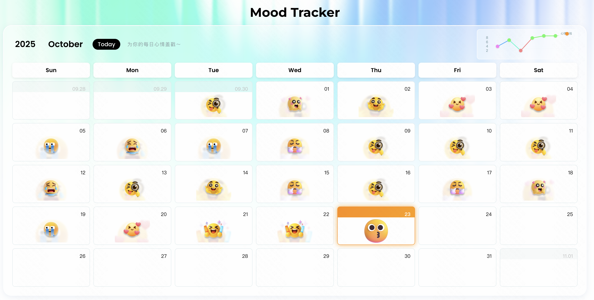
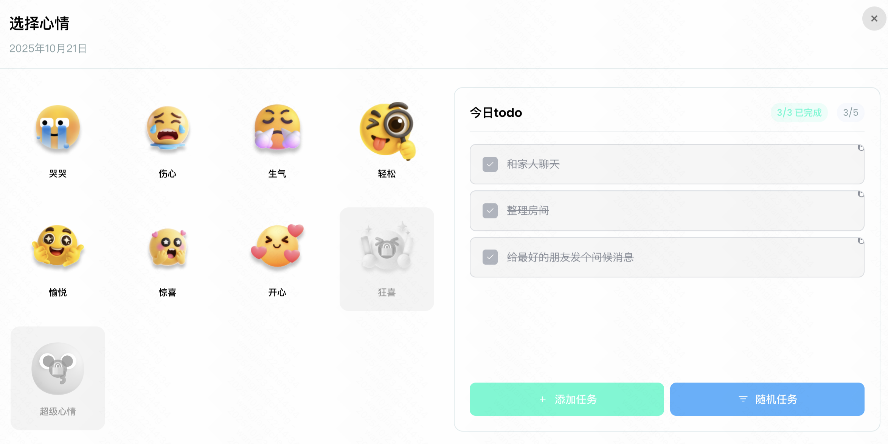

# 🌈 一个让你变开心的情绪日历

一个简洁美观的心情日历应用，不仅帮助你记录每一天的心情状态，还能够通过todo list解锁更多快乐能量！



## ✨ 功能特点

-  **为每日心情盖戳** - 记录你的每日情绪状态
-  **记录每天的todo list** - 管理你的日常任务
-  **完成任务解锁心情** - 每完成一个todo，即可解锁更高级的心情！

## 💡 设计理念

我们有理由相信，心情不会自己变得开心（当然可能会受到激素影响）。在情绪上，我常常希望自己能够获得主动。

所以有了这个情绪日历。每当你完成一项任务，即可解锁一个更高级的心情，当你完成满五个任务的时候，你还可以获得一个超级心情。



## 🎲 随机任务

如果你不知道怎么填满自己的todo list，没有关系，我们为你内置了"随机任务"，不用担心，这些任务都是"休闲"性质的，比如"今晚九点之前下班"，"回家的路上顺便买点水果"

## 🚀 技术栈

- **框架**: React 18.x
- **语言**: TypeScript 5.x
- **构建工具**: Vite 5.x
- **样式**: CSS Modules
- **UI组件库**: Ant Design 5.x

## 📦 安装与运行

```bash
# 安装依赖
npm install

# 启动开发服务器
npm run dev

# 构建生产版本
npm run build
```
